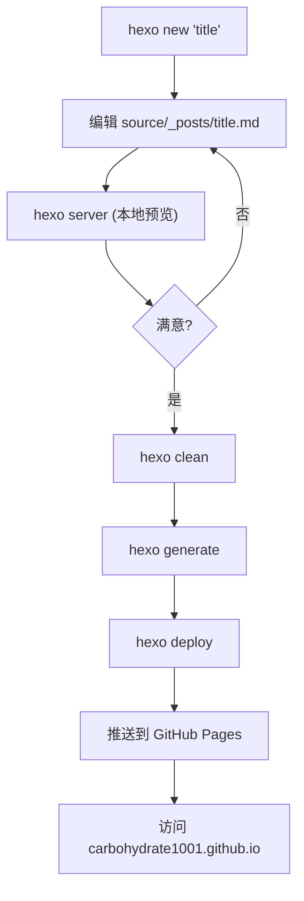

# Carbospace Hexo 博客使用手册

> 本手册适用于 **Carbospace** 博客项目（基于 Hexo 7.3.0 + NexT 主题），部署于 [https://carbohydrate1001.github.io](https://carbohydrate1001.github.io)。
>
> **所有命令均在项目根目录 `carbospace/` 下执行。**

---

## 目录

- [Carbospace Hexo 博客使用手册](#carbospace-hexo-博客使用手册)
  - [目录](#目录)
  - [第一部分：创建新博客并完成上传](#第一部分创建新博客并完成上传)
    - [1.1 环境前提](#11-环境前提)
    - [1.2 创建新文章](#12-创建新文章)
    - [1.3 Front-matter 配置详解](#13-front-matter-配置详解)
    - [1.4 Markdown 写作指南](#14-markdown-写作指南)
      - [标题](#标题)
      - [文本格式](#文本格式)
      - [列表](#列表)
      - [链接与图片](#链接与图片)
      - [代码块](#代码块)
      - [数学公式](#数学公式)
      - [文章摘要分隔](#文章摘要分隔)
    - [1.5 本地预览](#15-本地预览)
    - [1.6 生成静态文件与部署上传](#16-生成静态文件与部署上传)
      - [第一步：清理旧文件](#第一步清理旧文件)
      - [第二步：生成静态文件](#第二步生成静态文件)
      - [第三步：部署到 GitHub Pages](#第三步部署到-github-pages)
      - [一键完成（推荐）](#一键完成推荐)
  - [第二部分：同步本地与 GitHub Pages](#第二部分同步本地与-github-pages)
    - [2.1 部署机制解析](#21-部署机制解析)
    - [2.2 标准同步流程](#22-标准同步流程)
    - [2.3 URL 配置说明](#23-url-配置说明)
    - [2.4 常见问题排查](#24-常见问题排查)
      - [问题 1：SSH 连接失败](#问题-1ssh-连接失败)
      - [问题 2：部署后页面未更新](#问题-2部署后页面未更新)
      - [问题 3：样式/CSS 丢失](#问题-3样式css-丢失)
      - [问题 4：`hexo command not found`](#问题-4hexo-command-not-found)
      - [问题 5：端口被占用](#问题-5端口被占用)
    - [2.5 草稿工作流（进阶）](#25-草稿工作流进阶)
      - [创建草稿](#创建草稿)
      - [预览草稿](#预览草稿)
      - [发布草稿](#发布草稿)
  - [附录：工作流总览图](#附录工作流总览图)

---

## 第一部分：创建新博客并完成上传

### 1.1 环境前提

在开始之前，请确认你的开发环境已安装以下工具：

| 工具     | 最低版本 | 检查命令          | 说明                         |
| -------- | -------- | ----------------- | ---------------------------- |
| Node.js  | 14.x     | `node -v`         | Hexo 运行时环境              |
| npm      | 6.x      | `npm -v`          | Node 包管理器                |
| Git      | 2.x      | `git --version`   | 版本控制与部署工具           |
| Hexo CLI | 4.x      | `hexo version`    | Hexo 命令行工具              |

**如果尚未安装 Hexo CLI**，请执行：

```bash
npm install -g hexo-cli
```

**SSH Key 配置**：由于项目通过 SSH 方式（`git@github.com:...`）部署到 GitHub，你需要确保本机的 SSH 密钥已添加到 GitHub 账户。可以通过以下命令测试连接：

```bash
ssh -T git@github.com
```

如果看到类似 `Hi Carbohydrate1001! You've successfully authenticated...` 的消息，说明配置正确。

---

### 1.2 创建新文章

使用 Hexo 命令创建新的博客文章：

```bash
hexo new "我的新文章标题"
```

执行后，Hexo 会根据模板文件 `scaffolds/post.md` 在 `source/_posts/` 目录下生成一个新的 Markdown 文件：

```
source/_posts/我的新文章标题.md
```

> **提示**：文件名中的空格会被替换为连字符 `-`，例如 `hexo new "My First Post"` 会生成 `source/_posts/My-First-Post.md`。

你也可以指定布局（layout）来创建不同类型的内容：

```bash
hexo new post "普通文章"      # 默认，等同于 hexo new "普通文章"
hexo new page "关于我"        # 创建独立页面（生成到 source/关于我/index.md）
hexo new draft "草稿文章"     # 创建草稿（生成到 source/_drafts/草稿文章.md）
```

---

### 1.3 Front-matter 配置详解

每篇文章的开头都有一个 YAML 格式的 **Front-matter** 区域，被 `---` 包裹。它控制文章的元数据。

本项目的文章模板（`scaffolds/post.md`）默认生成如下 Front-matter：

```yaml
---
title: {{ title }}
date: {{ date }}
tags:
---
```

以下是所有常用字段的说明：

| 字段         | 说明                                   | 示例                                         |
| ------------ | -------------------------------------- | -------------------------------------------- |
| `title`      | 文章标题                               | `title: 深度学习入门笔记`                    |
| `date`       | 创建日期（自动生成）                   | `date: 2026-03-02 14:30:00`                  |
| `updated`    | 更新日期                               | `updated: 2026-03-05 10:00:00`               |
| `tags`       | 标签（可多个）                         | 见下方示例                                   |
| `categories` | 分类（可多层级）                       | 见下方示例                                   |
| `excerpt`    | 文章摘要                               | `excerpt: 这是一篇关于...的文章`             |
| `permalink`  | 自定义永久链接                         | `permalink: my-custom-url/`                  |
| `comments`   | 是否开启评论                           | `comments: false`                            |

**标签和分类的写法示例**：

```yaml
---
title: 深度学习入门笔记
date: 2026-03-02 14:30:00
tags:
  - Deep Learning
  - Python
  - PyTorch
categories:
  - 技术笔记
  - AI
---
```

> **标签 vs 分类**：标签（tags）是扁平的，可以任意多个；分类（categories）具有层级关系，上面示例中 `AI` 是 `技术笔记` 的子分类。

---

### 1.4 Markdown 写作指南

Front-matter 下方的内容就是文章正文，使用标准 Markdown 语法。以下是常用语法速查：

#### 标题

```markdown
## 二级标题
### 三级标题
#### 四级标题
```

> 注意：一级标题 `#` 通常由文章的 `title` 字段自动渲染，正文中建议从二级标题 `##` 开始。

#### 文本格式

```markdown
**粗体文本**
*斜体文本*
~~删除线~~
`行内代码`
```

#### 列表

```markdown
- 无序列表项 1
- 无序列表项 2

1. 有序列表项 1
2. 有序列表项 2
```

#### 链接与图片

```markdown
[链接文字](https://example.com)


```

**插入本地图片**有两种方式：

**方式一：放到 `source/images/` 目录**

将图片放入 `source/images/` 文件夹，然后在文章中引用：

```markdown

```

**方式二：使用文章资源文件夹（需额外配置）**

在 `_config.yml` 中开启 `post_asset_folder: true`，之后每次 `hexo new` 会在 `source/_posts/` 下创建同名文件夹，将图片放入其中，然后使用相对路径引用：

```markdown

```

> 当前项目 `post_asset_folder` 设置为 `false`，推荐使用**方式一**。

#### 代码块

使用三个反引号包裹代码，并指定语言：

````markdown
```python
def hello():
    print("Hello, Carbospace!")
```
````

#### 数学公式

如果 NexT 主题开启了数学公式支持，可以使用 LaTeX 语法：

```markdown
行内公式：$E = mc^2$

独立公式：
$$
\frac{\partial f}{\partial x} = 2x + 1
$$
```

#### 文章摘要分隔

在文章中插入 `<!-- more -->` 标记，其上方的内容将作为首页预览摘要：

```markdown
这是文章摘要部分，会显示在首页列表中。

<!-- more -->

这是完整文章的后续内容，只有点进文章才能看到。
```

---

### 1.5 本地预览

写完文章后，可以启动本地服务器进行预览：

```bash
hexo server
```

或使用 npm 脚本：

```bash
npm run server
```

默认情况下，本地服务器会在 `http://localhost:4000` 启动。打开浏览器访问即可实时预览博客效果。

**常用选项**：

```bash
hexo server -p 5000      # 指定端口为 5000
hexo server --draft       # 同时预览草稿文章
hexo server -s            # 仅使用静态文件（需先 hexo generate）
```

按 `Ctrl + C` 停止本地服务器。

> **提示**：本地服务器支持热重载，修改文章内容后刷新浏览器即可看到最新效果（无需重启服务器）。

---

### 1.6 生成静态文件与部署上传

确认文章在本地预览无误后，执行以下三步完成部署：

#### 第一步：清理旧文件

```bash
hexo clean
```

删除之前生成的静态文件（`public/` 目录）和缓存（`db.json`），避免残留内容导致问题。

#### 第二步：生成静态文件

```bash
hexo generate
```

或简写：

```bash
hexo g
```

Hexo 会将所有 Markdown 文章渲染为 HTML，并输出到 `public/` 目录。

#### 第三步：部署到 GitHub Pages

```bash
hexo deploy
```

或简写：

```bash
hexo d
```

该命令会将 `public/` 目录中的内容通过 Git 推送到远程仓库 `Carbohydrate1001.github.io` 的 `master` 分支。

#### 一键完成（推荐）

可以将三步合并为一条命令：

```bash
hexo clean && hexo generate && hexo deploy
```

或者合并生成和部署：

```bash
hexo g -d
```

部署成功后，等待 1-2 分钟，访问 [https://carbohydrate1001.github.io](https://carbohydrate1001.github.io) 即可查看更新后的博客。

---

## 第二部分：同步本地与 GitHub Pages

### 2.1 部署机制解析

理解部署机制有助于排查问题。当前项目使用 `hexo-deployer-git` 插件进行部署，其工作流程如下：

1. `hexo generate` 将 Markdown 文件渲染为 HTML，输出到 `public/` 目录
2. `hexo deploy` 将 `public/` 目录的全部内容复制到 `.deploy_git/` 目录
3. 在 `.deploy_git/` 中执行 `git add`、`git commit`、`git push`，将内容推送到远程仓库

**关键配置**（`_config.yml` 文件末尾）：

```yaml
deploy:
  type: git
  repo: git@github.com:Carbohydrate1001/Carbohydrate1001.github.io.git
  branch: master
```

| 字段     | 含义                                       |
| -------- | ------------------------------------------ |
| `type`   | 部署方式，使用 git                          |
| `repo`   | 远程 GitHub 仓库的 SSH 地址                |
| `branch` | 推送到的目标分支（GitHub Pages 读取此分支） |

> **注意**：`.deploy_git/` 目录是自动管理的，**请勿手动修改其中的文件**。

---

### 2.2 标准同步流程

每次需要将本地更改同步到线上 GitHub Pages 时，按照以下流程操作：

```
┌──────────────────────────────────────────────────────────────────────┐
│                        标准同步流程                                  │
├──────────────────────────────────────────────────────────────────────┤
│                                                                      │
│  1. 编辑/新增文章       →  source/_posts/ 中编辑 Markdown 文件       │
│  2. 本地预览 (可选)     →  hexo server                               │
│  3. 清理缓存            →  hexo clean                                │
│  4. 生成静态文件        →  hexo generate                             │
│  5. 部署到远程          →  hexo deploy                               │
│  6. 验证上线            →  访问 https://carbohydrate1001.github.io   │
│                                                                      │
└──────────────────────────────────────────────────────────────────────┘
```

**完整命令序列**：

```bash
# 1. 确认在 carbospace 目录下
cd D:/Desktop/Workspace/Learn-a-little-bit-about-EVERYTHING/carbospace

# 2. (可选) 本地预览确认
hexo server
# 确认无误后 Ctrl+C 停止

# 3. 一键清理、生成、部署
hexo clean && hexo generate && hexo deploy
```

部署完成后，终端会显示类似以下信息：

```
INFO  Deploy done: git
```

等待 1-2 分钟后，GitHub Pages 会自动更新。

---

### 2.3 URL 配置说明

`_config.yml` 中的 `url` 字段必须与你的 GitHub Pages 地址一致，否则会导致 CSS/JS 资源路径错误、页面样式丢失：

```yaml
# 正确配置
url: https://carbohydrate1001.github.io
```

> ⚠️ **重要提示**：本项目已将此配置从默认的 `http://example.com` 修正为 `https://carbohydrate1001.github.io`。如果你发现线上博客样式异常，请首先检查此项配置。

---

### 2.4 常见问题排查

#### 问题 1：SSH 连接失败

**症状**：执行 `hexo deploy` 时报错 `Permission denied (publickey)`

**解决方案**：

```bash
# 1. 检查是否已有 SSH Key
ls ~/.ssh/id_rsa.pub

# 2. 如果没有，生成新的 SSH Key
ssh-keygen -t rsa -C "your-email@example.com"

# 3. 复制公钥
cat ~/.ssh/id_rsa.pub
# 将输出的内容添加到 GitHub → Settings → SSH and GPG keys

# 4. 测试连接
ssh -T git@github.com
```

#### 问题 2：部署后页面未更新

**可能原因和解决方案**：

1. **浏览器缓存**：按 `Ctrl + Shift + R`（Windows）或 `Cmd + Shift + R`（Mac）强制刷新
2. **GitHub Pages 延迟**：部署后需要等待 1-5 分钟，GitHub 才会完成构建
3. **未清理缓存**：确保在部署前执行了 `hexo clean`
4. **检查部署状态**：前往 GitHub 仓库的 `Actions` 或 `Deployments` 页面查看是否有构建错误

#### 问题 3：样式/CSS 丢失

**症状**：页面内容正常但没有样式

**解决方案**：

1. 确认 `_config.yml` 中的 `url` 配置正确（见 [2.3 URL 配置说明](#23-url-配置说明)）
2. 执行完整的清理重新部署：

```bash
hexo clean && hexo generate && hexo deploy
```

#### 问题 4：`hexo command not found`

**解决方案**：

```bash
# 全局安装 Hexo CLI
npm install -g hexo-cli

# 或者使用 npx 运行（无需全局安装）
npx hexo generate
npx hexo deploy
```

#### 问题 5：端口被占用

**症状**：`hexo server` 报错 `EADDRINUSE`

**解决方案**：

```bash
# 使用其他端口
hexo server -p 5000
```

---

### 2.5 草稿工作流（进阶）

如果你希望先写草稿、确认后再发布，可以使用 Hexo 的草稿功能：

#### 创建草稿

```bash
hexo new draft "草稿文章标题"
```

文件会生成在 `source/_drafts/` 目录下（不会出现在正式博客中）。

#### 预览草稿

```bash
hexo server --draft
```

加上 `--draft` 参数后，本地预览时可以看到草稿内容。

#### 发布草稿

当草稿准备好发布时：

```bash
hexo publish "草稿文章标题"
```

该命令会将草稿从 `source/_drafts/` 移动到 `source/_posts/`，并自动补充 `date` 字段。之后按照正常流程部署即可。

---

## 附录：工作流总览图

以下流程图展示了从创建文章到上线的完整工作流：



**快速参考命令表**：

| 操作             | 命令                                      | 简写       |
| ---------------- | ----------------------------------------- | ---------- |
| 创建新文章       | `hexo new "标题"`                          | -          |
| 创建草稿         | `hexo new draft "标题"`                    | -          |
| 发布草稿         | `hexo publish "标题"`                      | -          |
| 启动本地预览     | `hexo server`                              | `hexo s`   |
| 清理缓存         | `hexo clean`                               | -          |
| 生成静态文件     | `hexo generate`                            | `hexo g`   |
| 部署到远程       | `hexo deploy`                              | `hexo d`   |
| 生成并部署       | `hexo generate --deploy`                   | `hexo g -d`|
| 一键三连         | `hexo clean && hexo generate && hexo deploy` | -        |

---

> 📝 **最后提示**：建议将博客项目源代码（`carbospace/` 整个目录）也推送到一个单独的 GitHub 仓库做备份，因为 `hexo deploy` 只推送生成后的静态文件，不包括你的 Markdown 源文件和配置文件。
